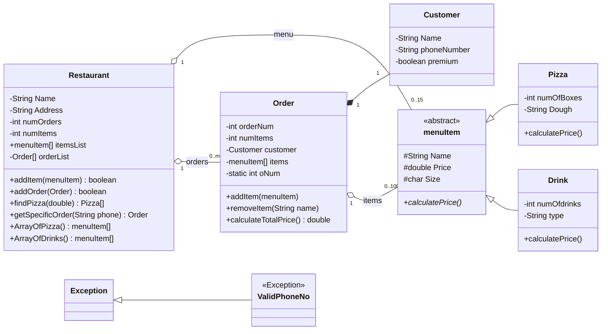

# Restaurant Ordering System (Java Swing)

## Project Overview

This project was developed as part of **CSC 113 – Computer Programming II** at **King Saud University**, with a primary focus on applying core **Object-Oriented Programming (OOP)** concepts in a practical software application.

A **restaurant ordering system** was selected as the main use case to demonstrate how different objects and classes can interact within a complete application. The system models key restaurant operations such as creating a restaurant, building a menu, managing customers, creating orders, calculating prices, and saving restaurant data.

The application was developed using **Java** and **Java Swing** for the graphical user interface, with **object serialization** used to save and load restaurant information.

---

## Project Objectives

The project was designed to practice and apply the following programming concepts:

- Object-Oriented Programming
- Class design and object interaction
- Inheritance
- Abstraction
- Polymorphism
- Encapsulation
- Composition and aggregation
- Exception handling
- File I/O and object serialization
- Graphical User Interface development using Java Swing

---

## Application Flow

```mermaid
flowchart LR
    A[Start Application] --> B[Create Restaurant]
    B --> C[Enter Restaurant Information]
    C --> D[Build Restaurant Menu]

    D --> E{Select Menu Item}
    E -->|Pizza| F[Add Pizza]
    E -->|Drink| G[Add Drink]

    F --> H[Restaurant Menu]
    G --> H

    H --> I[Create Customer Order]
    I --> J[Enter Customer Information]
    J --> K[Select Menu Items]
    K --> L[Add or Remove Items]
    L --> M[Calculate Order Total]

    M --> N[Save Restaurant Data]
    N --> O[Display Restaurant and Orders]
    O --> P[End]
```



---

## Class Diagram



---

## Main Features

- Create a restaurant with basic restaurant information.
- Build a restaurant menu.
- Add pizza and drink items.
- Create customer orders.
- Store customer information.
- Add and remove menu items from an order.
- Calculate the total order price.
- Apply different pricing logic depending on the selected item.
- Search for pizzas below a specified price.
- Search for customer orders using a phone number.
- Validate customer phone numbers.
- Save restaurant information and orders to a file.
- Read and display saved restaurant and order information.

---

## OOP Concepts Used

### Inheritance

`Pizza` and `Drink` inherit from the abstract `menuItem` class.

```text
menuItem
├── Pizza
└── Drink
```

This allows different types of menu items to share common attributes and behavior while maintaining their own specialized implementation.

### Abstraction

The `menuItem` class is defined as an abstract class and contains the abstract method:

```java
public abstract void calculatePrice();
```

Each subclass provides its own implementation of the pricing logic.

### Polymorphism

The system handles `Pizza` and `Drink` objects through the common `menuItem` type while allowing each subclass to perform its own `calculatePrice()` behavior.

### Encapsulation

Class attributes are mainly declared as private or protected and are accessed through constructors and getter methods.

### Composition and Aggregation

The project models relationships between multiple objects:

- A `Restaurant` contains menu items.
- A `Restaurant` contains multiple orders.
- An `Order` contains a `Customer`.
- An `Order` contains multiple menu items.

These relationships demonstrate how different objects interact as part of a larger system.

### Custom Exception Handling

The project includes a custom exception class:

```java
ValidPhoneNo
```

It is used to validate customer phone numbers and ensure that the entered value contains exactly 10 digits.

### File I/O and Serialization

The main data model classes are serializable, allowing the `Restaurant` object, including its menu and orders, to be saved and loaded from disk.

The project uses:

```java
ObjectOutputStream
ObjectInputStream
```

for object serialization and deserialization.

---

## Graphical User Interface

The application uses **Java Swing** to provide a graphical interface for the main system operations.

The GUI includes screens for:

- Creating the restaurant.
- Building the restaurant menu.
- Creating customer orders.
- Managing pizza and drink selections.
- Displaying restaurant and order information.

The GUI forms were generated and developed using **NetBeans**.

---

## Main Classes

| Class | Purpose |
|---|---|
| `Restaurant` | Stores restaurant information, menu items, and orders |
| `Order` | Represents a customer order and manages selected items |
| `Customer` | Stores customer information |
| `menuItem` | Abstract parent class for restaurant menu items |
| `Pizza` | Represents pizza items and their pricing logic |
| `Drink` | Represents drink items and their pricing logic |
| `ValidPhoneNo` | Custom exception for phone-number validation |
| `CreateRestaurant` | GUI for creating restaurant information |
| `CreatingMenu` | GUI for creating restaurant menu items |
| `RestaurantOrderes` | GUI for creating and managing customer orders |
| `Display` | Displays saved restaurant and order information |
| `TestRestaurant` | Main entry point of the application |

---

## Data Storage

Restaurant data is stored using Java object serialization.

The system saves the restaurant object to a `.ser` file, allowing restaurant information, menu items, customers, and orders to be loaded again later.

---

## Technologies

- Java
- Java Swing
- NetBeans
- Object-Oriented Programming
- Java Serialization
- File I/O

---

## How to Run

Compile the Java files:

```bash
javac *.java
```

Run the application:

```bash
java TestRestaurant
```

Alternatively, open the project in **NetBeans** and run:

```text
TestRestaurant.java
```

---

## Course Information

**Course:** CSC 113 – Computer Programming II  
**Institution:** King Saud University

This project was developed as an academic course project to apply object-oriented programming concepts through a practical restaurant-ordering scenario.
